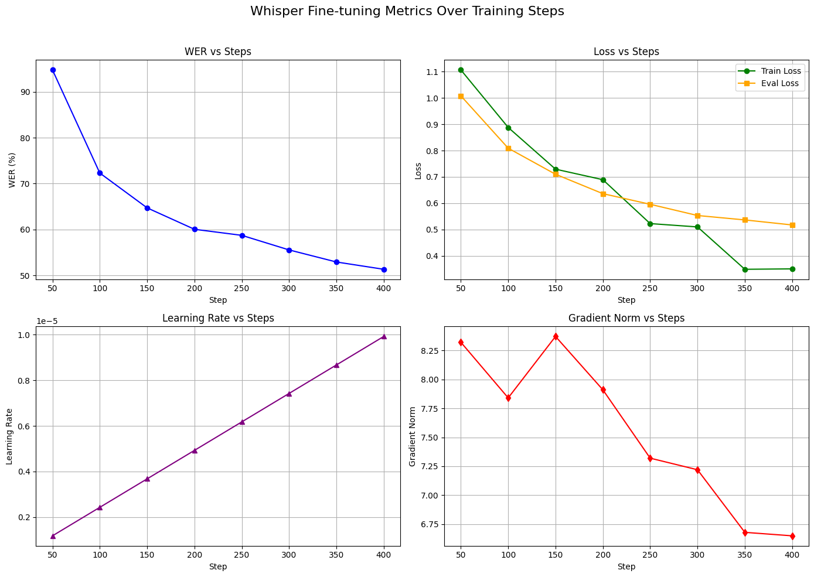
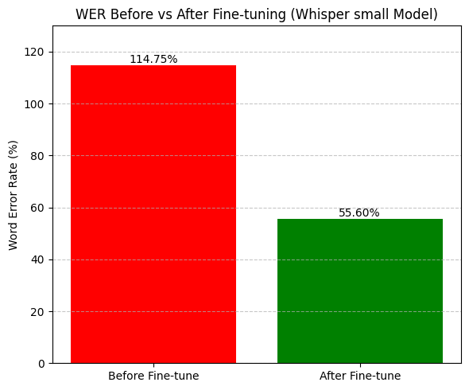
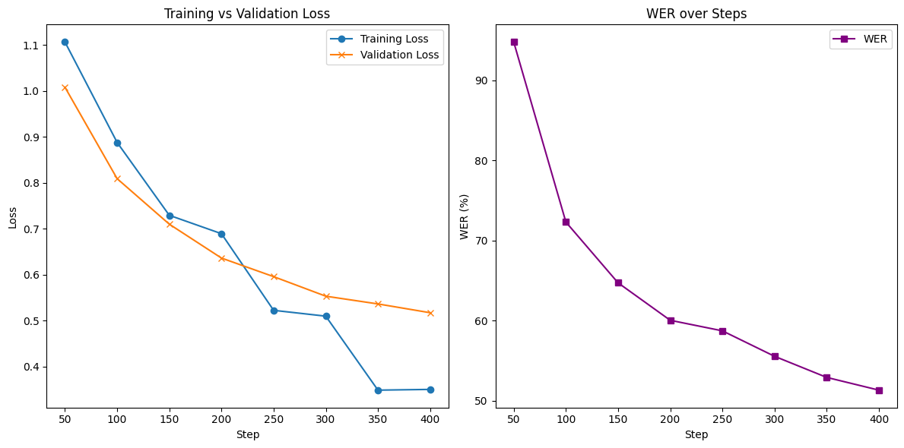

# 🚀 FastTuneWhisper

**FastTuneWhisper** is a production-ready multimodal search system that enables fast **text** and **image-based** search over YouTube videos. It leverages **fine-tuned Whisper**, **CLIP embeddings**, and **ChromaDB** to build a searchable video content index.

<br>

## 📊 Model Training Results

Some results from fine-tuning Whisper on a domain-specific dataset:

| Metric                   | Observation                                                                 |
|--------------------------|------------------------------------------------------------------------------|
| **WER vs Steps**         | Shows consistent improvement, decreasing from ~94.78% to ~51.32%.           |
| **Loss vs Steps**        | Both training and evaluation losses steadily decrease over time.            |
| **Learning Rate vs Steps** | Learning rate increases over training as expected in warm-up scheduling.    |
| **Gradient Norm vs Steps** | Gradual reduction indicates stable training dynamics.                      |
| **Before vs After WER**  | Word Error Rate dropped from **114.75%** to **55.60%** after fine-tuning.   |

<p align="center">
  
  <br>
  <em>Figure: Fine-tuning metrics - WER, Loss, LR, and Grad Norm over steps</em>
</p>

<p align="center">
  
  <br>
  <em>Figure: Word Error Rate Before vs After Fine-tuning</em>
</p>

<p align="center">
  
  <br>
  <em>Figure: Training & Validation Loss and WER trend</em>
</p>

> 📌 Note: The Whisper model used is `small`, fine-tuned on a custom dataset. Results may vary with different domains or languages.

## 🔍 Key Features

* 🎥 Accepts YouTube video URLs
* 🧠 Scene-based frame extraction
* 📝 Audio transcription using **Fast/Fine-tuned Whisper**
* 💡 Text & image embeddings using **CLIP (ViT-B/32)**
* 🔎 Multimodal search support: **text-to-video** and **image-to-video**
* ⚡ FastAPI backend + Streamlit frontend
* 🗃 Persistent vector storage with **ChromaDB**

<br>

## 📁 Project Structure

```
FastTuneWhisper/
├── backend/
│   ├── audio_processing.py         
│   ├── chromadb_functions.py       
│   ├── download_video.py           
│   ├── extract_scenes_from_video.py
│   ├── extract_text.py             
│   ├── image_text_emb.py           
│   ├── search_functions.py         
│   ├── video_fusion_search.py      
│   └── main.py                     
│
├── frontend/
│   └── frontend.py                 
│
├── notebook/
│   ├── text_processing.ipynb       
│   ├── image_processing.ipynb      
│   └── image_processing2.ipynb     
│
├── .gitignore
├── env
├── requirements.txt
└── README.md
```

<br>

## ⚙️ Setup Instructions

### 1. Clone the repository

```bash
git clone https://github.com/jigneshshiyal/FastTuneWhisper.git
cd FastTuneWhisper
```

### 2. Create a virtual environment

```bash
python -m venv env
source env/bin/activate  # Windows: .\env\Scripts\activate
```

### 3. Install dependencies

```bash
pip install -r requirements.txt
```

### 4. Start FastAPI backend

```bash
cd backend
uvicorn main:app --reload --port 8000
```

### 5. Start Streamlit frontend

```bash
cd ../frontend
streamlit run frontend.py
```

<br>

## 🧪 How It Works

1. 🎬 **Embed Video** – Paste a YouTube URL, system extracts audio + scenes, then generates embeddings.
2. 🔍 **Search** – Input a text prompt or upload an image to find matching timestamps.
3. 🕒 **Jump** – Click on the returned timestamp to jump directly into the relevant video moment.

<br>

## 🧠 Models & Libraries

* 🗣 **Whisper (distil-large-v3)** – For fast and accurate transcription
* 🖼 **OpenAI CLIP (ViT-B/32)** – Unified text-image embeddings
* 📦 **ChromaDB** – Vector database for fast similarity search
* ⚙️ **SceneDetect + OpenCV** – Scene-based keyframe extraction

<br>

## ✅ Requirements

* Python 3.8+
* `ffmpeg` (ensure it's in your PATH)
* Internet access for downloading YouTube videos and model weights

<br>

## 📌 Notebooks

Located in the `notebook/` folder:

* Analyze and visualize text/image embeddings
* Useful for testing and debugging the CLIP embedding space

<br>

## 🚀 Future Ideas

* Export ONNX for in-browser or mobile inference
* Add video thumbnails to search results
* Support for multilingual transcription (Whisper large-v3)

<br>

## 📄 License

MIT License © 2025 Jignesh Shiyal

